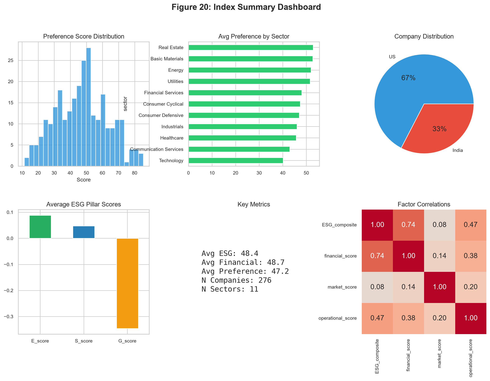
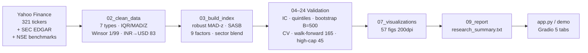

# ESG Hybrid Index — Multi-Factor ESG-Integrated Mid-Cap Index

<p align="center">
  <strong>Transparent · Reproducible · Auditable</strong><br/>
  9-factor ESG-integrated composite for <strong>269</strong> mid-cap equities (181 US + 88 India) + 45 large-cap reference firms · snapshot 2026-04-02 · genuine out-of-sample test
</p>

<p align="center">
  <a href="https://huggingface.co/spaces/Shashwat1729/esg-hybrid-index"></a>&nbsp;
  <a href="Paper/Thesis.pdf"></a>&nbsp;
  <a href="#quick-start"></a>
</p>

<p align="center">
  
  
  
  
  
  
</p>

<p align="center">
  <em>Out of sample (2026-04-02 → 2026-09-23) the composite does <strong>not</strong> predict returns; ESG <strong>does</strong> predict lower future volatility — see results ↓</em>
</p>

---

## ✨ Why this project

Mid-cap ESG investing is bottlenecked by **sparse disclosure, provider disagreement (r≈0.38), and single-factor tilts**. This repo builds a **fully open, config-driven** 9-factor index you can run, audit, fork, and deploy — from raw Yahoo/SEC data to portfolio, validation, paper, and live demo in **one command**.

| What you get | How |
|---|---|
| **Live demo** you can verify, not a mock | Gradio app reads `data/processed/indexed_data.csv` + `reports/tables/*.csv` — zero hardcoded numbers |
| **Provenance per cell** | 6-tier ESG pipeline (`real_yahoo` → `real_sec` → `financial_proxy` → `sector_median` → `global_median` → `NaN`) tracked in `esg_data_provenance.csv` |
| **Leakage-guarded** | Scores frozen at the 2026-04-02 close; firms not trading that day removed; `market_score` carries zero weight |
| **Honest results** | Pre-declared out-of-sample test (Holm-corrected): no return predictability, ESG predicts lower future volatility; audit log in `docs/RESEARCH_AUDIT.md` |
| **Paper generated from code** | `scripts/26_paper_artifacts.py` writes every number/table/figure the paper cites (`Paper/generated/`); 325 tests; pre-registered window 2 in `preregistration/` |

---

## 🚀 Live Demo

|  |  |
|---|---|
| **Local** | `python app.py` → `http://localhost:7860` |
| **Hosted** | **https://huggingface.co/spaces/Shashwat1729/esg-hybrid-index** · bundle ready in `demo/` — see `docs/DEMO.md` for one-push deploy |

**5 tabs** (all from real outputs):

- **Company Explorer** — 10-factor radar + AAA–CCC rating + balanced rank
- **Company Comparison** — side-by-side radar + profile-weighted winner & differentiator
- **Investment Screener** — filter by ESG/financial/volatility/sector, ranked by `pref_*`
- **Portfolio Builder** — equal-weighted aggregate vs universe radar + sector pie
- **Index Methodology** — live weight sliders (auto-renormalized) → re-ranking
- **About & Methodology** — pipeline, provenance, caveats, dataset stamp `N=314 · INR/USD=92.97 · snapshot 2026-04-02`, disclaimer

> **Not financial advice.** The composite did not predict returns out of sample. See `docs/RESEARCH_AUDIT.md` + Paper §VII.

<p align="center">
  
  <br/><em>Fig. 20 — Index summary dashboard (auto-generated, 200 DPI)</em>
</p>

---

## ⚡ Quick Start

### Option A — Exact replication (recommended, no API keys)

```bash
git clone https://github.com/Shashwat1729/esg-hybrid-index.git
cd esg-hybrid-index
python -m venv .venv
# Windows: .venv\Scripts\activate
# macOS/Linux: source .venv/bin/activate

pip install -r requirements.txt

# set UTF-8 for Windows consoles (fixes ⚠/→ in logs)
# PowerShell: $env:PYTHONUTF8="1"; $env:PYTHONIOENCODING="utf-8"
# Bash:      export PYTHONUTF8=1 PYTHONIOENCODING=utf-8

python scripts/run_all.py --skip-download   # 19/19 · ~7.5 min · uses committed data/raw
pytest -q                                   # 308 passed
python app.py                               # → http://localhost:7860
```

### Option B — Fresh market data (prices will drift)

```bash
# PowerShell
$env:SEC_EDGAR_USER_AGENT="YourName your@email.edu"
$env:PYTHONUTF8="1"; python scripts/run_all.py

# Bash
export SEC_EDGAR_USER_AGENT="YourName your@email.edu"
export PYTHONUTF8=1
python scripts/run_all.py
```


---

## 🧩 How it works

### The 9 deployed factors

| # | Factor | What it captures | Config key |
|---|---|---|---|
| 1 | **ESG Composite** | 12 categories → 3 pillars E/S/G → SASB sector-materiality weighted (Energy E 0.55 … Tech S 0.45) | `esg_index` |
| 2 | **Financial** | profitability / scale / efficiency / stability / valuation | `financial_scoring` |
| 3 | **Market** | liquidity / volatility / momentum — *excluded from deployed weights (C1 guard)* | `market_factors` |
| 4 | **Operational** | productivity / innovation / market position | `operational_quality` |
| 5 | **Risk-Adjusted** | Sharpe/Sortino/drawdown + tail risk | `risk_adjusted_scoring` |
| 6 | **Value** | inverted multiples (PE/PB/EV…) | `value_scoring` |
| 7 | **Growth** | revenue/earnings/sustainable growth | `growth_scoring` |
| 8 | **Stability** | leverage / liquidity / vol | `stability_scoring` |
| 9 | **Sector Position** | within-sector percentile | — |

`similarity_rank` (10th, r=0.70 with ESG) excluded. Overlap after dedup **0%**, `VIF max 2.04`, `50 + 10·z` → `[0,100]` single re-standardization. The isotonic "monotonicity correction" is disabled (it was fitted to the validation target; see `docs/RESEARCH_AUDIT.md`).

### Investor profiles (sum to 1.0)

| Factor | **ESG-First** | **Balanced** | **Financial-First** |
|---|---:|---:|---:|
| ESG | **0.55** | **0.22** | 0.05 |
| Financial | 0.08 | **0.18** | 0.25 |
| Market | 0.02 | 0.05 | 0.10 |
| Operational | 0.05 | 0.06 | 0.08 |
| Risk-Adjusted | 0.08 | **0.15** | 0.18 |
| Growth | 0.06 | 0.14 | 0.15 |
| Value | 0.03 | 0.04 | 0.07 |
| Stability | 0.06 | 0.08 | 0.07 |
| Sector Pos. | 0.07 | 0.08 | 0.05 |

Raw weights from `config/index_config.yaml`. In deployment the market weight is set to 0 and the rest renormalised (e.g. Balanced ESG = 23.2 %; Paper Table II). Aggregation: percentile rank over the 314 scored firms → weighted sum.

### Architecture



---

## 📦 Repository structure

```
.
├── app.py                 # Gradio (Company Explorer / Comparison / Screener / Portfolio / Methodology / About)
├── demo/                  # Hugging Face Space bundle (app.py + data/processed + config + README)
├── config/
│   ├── index_config.yaml       # universe, normalization, 9-factor weights, 3 profiles
│   ├── sasb_materiality.yaml   # sector E/S/G (11 sectors)
│   └── data_sources.yaml       # Yahoo/SEC on, commercial off
├── src/
│   ├── constants.py            # 9-factor weights ex-market, type metadata, LOWER_IS_BETTER
│   ├── utils.py                # robust_zscore, load_indexed_data, paths
│   ├── data_collection/        # data_pipeline, data_quality
│   ├── financial_scoring/      # financial_scorer, market_scorer
│   ├── index_construction/     # composite_index (normalize→aggregate→rescale)
│   └── similarity/             # cosine_similarity, preference_scoring
├── scripts/
│   ├── run_all.py              # canonical 19-step orchestrator (UTF-8 enforced)
│   ├── 01_download_data.py     # 6-tier hybrid ESG (real_yahoo/real_sec/financial_proxy/…)
│   ├── 02_clean_data.py … 24_geographic_robustness.py
│   └── 07_visualizations.py    # 57 figs 200dpi
├── tests/                 # 308 tests (13 modules + test_research_correctness 36 guards)
├── data/
│   ├── raw/               # committed 321-ticker snapshot (regenerated via 01)
│   └── processed/         # indexed_data.csv 321×202 + cleaning_metadata.json (tracked)
├── reports/
│   ├── tables/            # 170+ CSVs (VIF, IC, quintiles, bootstrap, CV, high-cap…)
│   ├── figures/           # 57 PNGs 200dpi (tracked for paper)
│   ├── research_summary.txt + key_findings.csv
│   └── analysis/          # 40+ deeper dives
├── docs/
│   ├── METHODOLOGY.md          # full pipeline & equations
│   ├── REPRODUCIBILITY.md      # one-command repro, seeds, env, what can't be reproduced
│   ├── RESEARCH_AUDIT.md       # leakage/bias/formula audit + verified numbers
│   ├── PAPER_CODE_RECONCILIATION.md # Paper ↔ code ↔ output line-by-line
│   └── DEMO.md                 # HF Spaces exact steps, Space card, troubleshooting
├── Paper/                 # IEEE conference paper: Thesis.tex (named), Submission.tex (anonymised)
├── Thesis_report/         # BITS Pilani thesis (LaTeX, Figures/ 24 PNGs, Missing_Packages/)
├── requirements.txt       # pinned (pandas 2.2.2, numpy 1.26.4, scipy, sklearn, statsmodels…)
├── pytest.ini             # 308 tests, markers slow/integration
└── LICENSE                # MIT 2026 Shashwat Bajpai
```

---

## 🔧 Configuration

All weights, thresholds, and methodology live in YAML — no code edits needed:

| File | What to tweak |
|---|---|
| `config/index_config.yaml` | universe (45 benchmarks, `large_cap_benchmarks`), `normalization: robust_zscore`, pillar/category weights, `preference_scoring.investor_profiles`, `RANDOM_SEED 42` |
| `config/sasb_materiality.yaml` | per-sector E/S/G (e.g. Energy 0.55/0.20/0.25) |
| `config/data_sources.yaml` | enable/disable Yahoo/SEC/commercial |

Change → `python scripts/03_build_index.py` → outputs, figures, tables, paper numbers update.

---

## 📊 Results — honest headline

> **A transparent, reproducible ranking whose ESG component behaves as a low-risk tilt, not an alpha signal.**
> All values below are regenerated into `Paper/generated/numbers.tex` by `scripts/26_paper_artifacts.py`.

| Finding | Value | Source |
|---|---:|---|
| Universe | **269** mid-caps (181 US + 88 India) + 45 large-cap reference firms; 7 non-trading firms removed | `indexed_data.csv`, `cleaning_metadata.json` |
| ESG informativeness | **21 of 34** declared indicators carry cross-sectional information | `esg_data_provenance.csv` |
| What ESG measures | E, S pillars ≈ financial proxies (R² on other factors **0.42 / 0.51**); G mostly ISS + ownership data (R² **0.03**) | Paper §V-A |
| In-sample "evidence" | IC 0.23 vs trailing 6m returns, 0.50 vs contemporaneous quality proxy — **not predictive** | `circularity_comparison.csv` |
| **H1** composite IC (OOS, country-neutral) | **−0.094**, 95% CI [−0.22, 0.04] — not supported | `oos_primary_hypotheses.csv` |
| **H2** ESG → lower realised vol given trailing vol | partial ρ **−0.163**, Holm p **0.013** — supported | `oos_primary_hypotheses.csv` |
| **H3** top-19 vs universe | **+1.9 pp**, CI ≈ [−11, 11] — not supported | `oos_portfolio_excess.csv` |
| ESG-only top-19 | **−19.9 pp** vs universe (−8.4 pp sector-neutral) in a rising market | `oos_portfolio_excess.csv` |
| Rank uncertainty | median 95% CI **15 ranks** for the top-19 | `bootstrap_rank_uncertainty_summary.csv` |
| Max VIF | **2.04** | `vif_multicollinearity.csv` |
| **H4** ESG → lower vol with 9 risk controls + sector/country FE | coef **−0.106** [−0.19, −0.02] | `ext_risk_controls.csv` |
| Where the risk signal lives | measured ESG cells **+0.03** (none); S pillar / proxy cells carry it | `ext_provenance_split.csv` |
| Is it stale volatility? | given 1st-half realised vol: **−0.066** (n.s.); out-of-fold R² gain **0.006** | `ext_recent_vol_control.csv`, `ext_vol_forecast_cv.csv` |
| Return null vs weights | IC negative under **96.7%** of 2,000 random weightings | `ext_weight_uncertainty.csv` |
| Pre-registered window 2 | (2026-09-28, 2027-03-31], H1–H4 hashed | `preregistration/window2/` |

Power: with N≈260, only |ρ| ≥ 0.17 is detectable at 80% power; one six-month window. See Paper §VII.

---

## 🧪 Development

```bash
# tests
pytest -q                      # 325 passed
pytest tests/test_research_correctness.py -v   # leakage/overlap/direction guards (36)
pytest -m "not slow"           # skip 500-iter bootstrap
pytest -m integration          # full pipeline integration

# lint / type (optional)
ruff check src/ scripts/
mypy src/

# single stage
python scripts/03_build_index.py   # idempotent, bit-identical on same clean_data.csv
```

CI: `CI=true pytest -q` (no prompts), `python scripts/14_run_checks.py` health checks.

---

## ☁️ Deployment

### Hugging Face Spaces (CPU basic, no GPU)

`demo/` **is** the Space. Push whole repo or just `demo/`:

```bash
# 1. create Space at hf.co/new-space → SDK Gradio, public, hardware CPU basic
# 2. push
git clone https://huggingface.co/spaces/<user>/esg-hybrid-index hf-space
cp -r demo/* hf-space/   # or cp app.py + data/processed/indexed_data.csv + config/
# ensure hf-space/README.md has Space card (title, sdk: gradio 4.44.0, app_file: app.py)
cd hf-space && git add . && git commit -m "deploy" && git push   # auto-builds ~1–2 min
```

`demo/README.md` Space card, `demo/requirements.txt` minimal (`pandas,numpy,gradio,plotly,pyyaml`). No secrets.

### Local

```bash
python app.py --server-name 0.0.0.0 --server-port 7860
```

---

## 📚 Documentation

| Doc | Purpose |
|---|---|
| [`docs/METHODOLOGY.md`](docs/METHODOLOGY.md) | Full pipeline, 7 variable types, 3-stage normalization, SASB, profile weights |
| [`docs/REPRODUCIBILITY.md`](docs/REPRODUCIBILITY.md) | One-command repro, seeds, configs, `--skip-download` bit-identical, env `SEC_EDGAR_USER_AGENT`, `PYTHONUTF8`, what can't be reproduced (survivorship, live prices) |
| [`docs/RESEARCH_AUDIT.md`](docs/RESEARCH_AUDIT.md) | Leakage/bias/formula audit, verified numbers, remaining limitations |
| [`docs/PAPER_CODE_RECONCILIATION.md`](docs/PAPER_CODE_RECONCILIATION.md) | Every table/figure ↔ CSV ↔ script ↔ LaTeX |
| [`docs/DEMO.md`](docs/DEMO.md) | HF Spaces exact steps, Space card, troubleshooting |
| [`Project.md`](Project.md) | Architecture, directory map, entry points |
| `reports/research_summary.txt` | Auto-generated 22-section report (743 lines) |

Paper: `Paper/Thesis.tex` (IEEE, named) and `Paper/Submission.tex` (same paper, anonymised for double-blind review); Thesis: `Thesis_report/main.tex` (BITS) — all compile from the same `reports/`.

```bash
cd Paper && pdflatex Submission && bibtex Submission && pdflatex Submission && pdflatex Submission
```

---

## 🙏 Acknowledgments

Yahoo Finance (`yfinance`), SEC EDGAR XBRL, SASB Materiality Map, Fama-French / Jegadeesh-Titman / Amihud / Gompers et al. / Khan et al. literature, Gradio, Hugging Face Spaces.

---

## 📄 Citation & License

```bibtex
@misc{bajpai2026esg,
  author = {Shashwat Bajpai},
  title  = {Multi-Factor ESG-Integrated Investment Index for Mid-Cap Equities (US + India)},
  year   = {2026},
  publisher = {GitHub},
  url    = {https://github.com/Shashwat1729/esg-hybrid-index}
}
```

**MIT** © 2026 Shashwat Bajpai — see [`LICENSE`](LICENSE). Data via Yahoo/SEC fair-access; Indian monetary fields converted at the snapshot-date close **INR/USD 92.97** (2026-04-02), stored in `data/processed/cleaning_metadata.json`.

---

<p align="center">
  <em>Academic research demonstration — not financial advice.</em><br/>
  <sub>Built with ❤️ for reproducible finance research · PRs welcome</sub>
</p>
